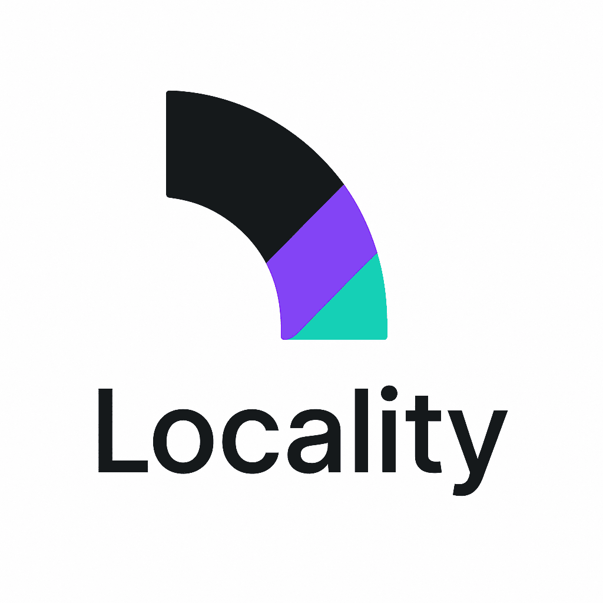

# Locality - Slim Linear Clone powered by Jazz

A modern issue tracking and project management application inspired by [Linear](https://linear.app), built with Next.js, React 19, TypeScript, and Tailwind CSS. This application uses Jazz as its data layer for real-time collaboration and state management.



## ✨ Features

- **Organization Management**: Create and manage organizations with custom teams
- **Issue Tracking**: Create, assign, and track issues with priorities and statuses
- **Team Collaboration**: Organize work by teams with dedicated workspaces
- **Real-time Updates**: See presence information of team members
- **Rich Content Editing**: Comment system with rich text editing via TipTap
- **Labels & Attachments**: Organize issues with labels and attach files
- **Responsive Design**: Works on desktop and mobile devices

## 🛠️ Tech Stack

- **Frontend**: Next.js 15, React 19, TypeScript
- **Styling**: Tailwind CSS, shadcn/ui components
- **State Management**: Jazz Tools, Zustand
- **UI Components**: Radix UI primitives
- **Forms**: React Hook Form with Zod validation
- **Icons**: Remix Icons, Lucide React
- **Animations**: Motion
- **Editor**: TipTap
- **Notifications**: Sonner

## 🏗️ Architecture

The application is built using Next.js App Router architecture with a modern component-based approach:

- **App Router**: Page routing based on file system with dynamic routes
- **Server Components**: Leveraging Next.js server components for improved performance
- **Data Layer**: Jazz provides a real-time collaborative data model
- **Component Structure**: Modular component design with clear separation of concerns
- **Authentication & Authorization**: Built-in user management via Jazz Auth + Passkeys
- **Real-time Collaboration**: Presence indicators and live updates

## 📁 Project Structure

```
slim-linear-clone/
├── app/                    # Next.js App Router pages and layouts
│   ├── [orgId]/            # Organization-specific routes
│   │   ├── issue/          # Issue detail pages
│   │   ├── members/        # Organization members management
│   │   ├── my-issues/      # Personal issues view
│   │   ├── settings/       # Organization settings
│   │   ├── team/           # Team-specific views
│   │   └── teams/          # Teams overview
│   ├── invite/             # User invitation flow
│   └── new-org/            # Create new organization flow
├── components/             # React components
│   ├── common/             # Shared domain components
│   │   ├── issues/         # Issue-related components
│   │   ├── members/        # Member management components
│   │   └── teams/          # Team-related components
│   ├── layout/             # Layout components
│   │   ├── headers/        # Header components
│   │   └── sidebar/        # Sidebar components
│   └── ui/                 # UI primitives and base components
├── hooks/                  # Custom React hooks
├── lib/                    # Utility functions and data schema
└── store/                  # State management
```

## 📊 Data Model

The application uses a rich data model defined in `jazz-schema.ts`:

- **Organization**: Top-level entity that contains teams and members
- **Team**: Group within an organization that owns issues
- **Issue**: Task or project item with status, priority, and assignee
- **Comment**: Discussion attached to issues
- **Label**: Categorization for issues with color coding
- **Attachment**: Files attached to issues or comments
- **UserProfile**: User information with online presence

The schema leverages Jazz's collaborative data types (CoMap, CoList, CoFeed) to enable real-time collaboration and updates.

## 🧩 UI Components

The UI is built with a combination of:

- **Radix UI primitives**: Accessible, unstyled components
- **shadcn/ui**: Styled components built on Radix
- **Custom components**: Domain-specific components for issues, teams, etc.

The design follows modern UI patterns with a clean, minimal aesthetic similar to Linear.

## 🚀 Getting Started

1. Clone the repository
2. Install dependencies:
   ```
   pnpm install
   ```
3. Run the development server:
   ```
   pnpm dev
   ```
4. Open [http://localhost:3000](http://localhost:3000) in your browser

## 💻 Development Practices

- **TypeScript**: Strict typing for all components and functions
- **Component Architecture**: Small, reusable components
- **Server/Client Separation**: Clear boundaries between server and client code
- **Responsive Design**: Mobile-first approach
- **Accessibility**: Built on accessible primitives from Radix UI

## 📄 License

MIT
